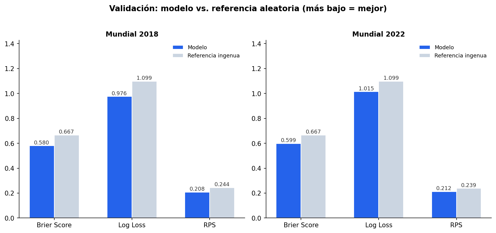
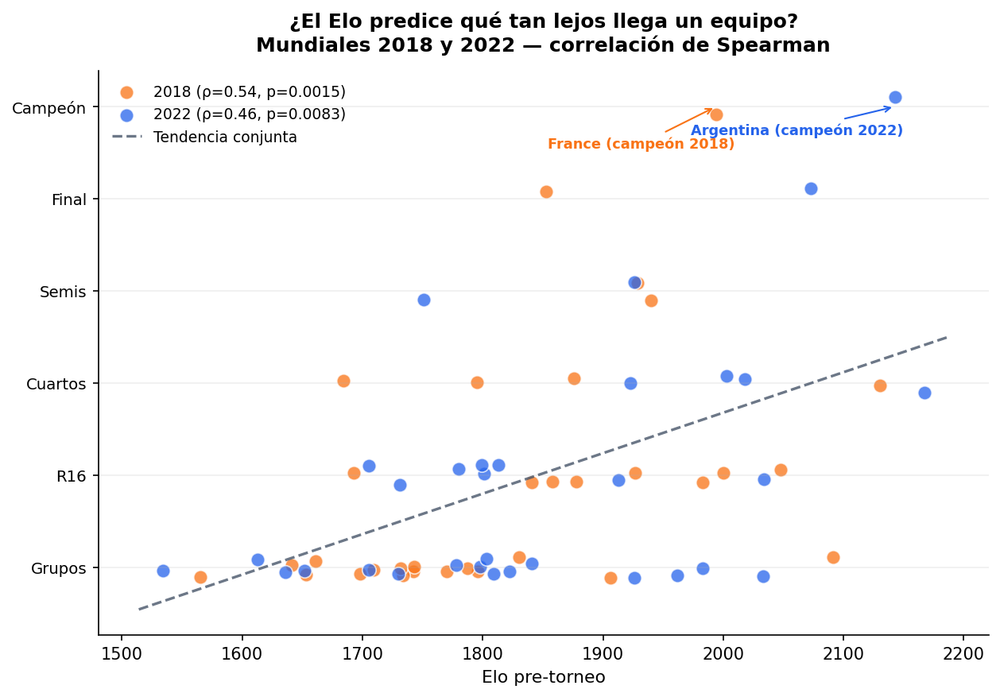

# Modelo Probabilístico del Mundial 2026

## Descripción

Un par de noches antes del inicio del Mundial 2026 leí en LinkedIn una publicación con la predicción del campeón del torneo, lo que me llevó a la pregunta: ¿qué tan bien se puede construir un modelo predictivo del torneo con poco tiempo y pocos recursos? Esta pregunta surge desde la perspectiva de que los Mundiales han llegado a ser muy impredecibles, incluso desde el punto de vista de analistas cualitativos expertos y expertas en el deporte.

El desafío de fondo no es trivial. Un Mundial de fútbol involucra un número considerable de variables relevantes: forma reciente, lesiones, decisiones tácticas, presión competitiva, dinámicas de vestidor; y una porción importante de ellas no es observable ni cuantificable con los datos disponibles públicamente. A eso se suma que el fútbol, particularmente en un torneo de esta naturaleza emocional, está sujeto a sesgos sistemáticos difíciles de modelar: el favoritismo no siempre se traduce en resultado, y la varianza del juego es alta incluso entre equipos de niveles muy distintos.

Este proyecto aborda esa pregunta con una premisa deliberada de simplicidad: un modelo sencillo, interpretable y honesto sobre sus propios límites. Se publica después de los primeros partidos del Mundial, tras ver cómo Cabo Verde empató a España —candidato fuerte— recordando que ninguna de estas limitaciones invalida el ejercicio; simplemente exige honestidad sobre qué puede y qué no puede capturar un modelo construido en estas condiciones.

El resultado es un sistema completo y reproducible: desde la curaduría de datos históricos hasta la simulación Monte Carlo del torneo, pasando por una validación estadística formal contra los Mundiales 2018 y 2022. La documentación metodológica detallada, incluyendo las decisiones tomadas y los errores corregidos en el camino, está disponible en [`docs/nota_tecnica.md`](docs/nota_tecnica.md).

---

## Datos

El proyecto se construye sobre tres fuentes externas, ninguna generada por el autor. Cada una se trata explícitamente como **dato prestado**, con su procedencia, licencia y limitaciones documentadas.

| Fuente | Rol en el proyecto | Cobertura |
|---|---|---|
| Resultados históricos de partidos internacionales (Kaggle, martj42) | Histórico de marcadores reales, 1872–2026 | ~49,500 partidos |
| Elo pre-torneo de las 48 selecciones clasificadas (Kaggle, vía eloratings.net) | Fuerza relativa de cada equipo al inicio del torneo | 48 equipos, snapshot único (27-may-2026) |
| Serie histórica de Elo (Kaggle, vía eloratings.net) | Fuerza relativa de cualquier selección en cualquier punto del tiempo, para entrenar el modelo | 270 equipos, 1872–2025 |

La necesidad de la tercera fuente no fue evidente desde el inicio. La primera versión del modelo usó únicamente el Elo de las 48 selecciones clasificadas para construir el set de entrenamiento, lo que produjo una cobertura de apenas 12% sobre el histórico de partidos: equipos como Italia, Chile o Nigeria —ausentes del Mundial 2026— no podían cruzarse contra ningún rival, simplemente porque no existían en esa fuente. La solución fue incorporar una serie histórica más amplia (270 equipos) exclusivamente para el entrenamiento, manteniendo el snapshot de 48 equipos únicamente para la simulación del torneo.

Una segunda complejidad surgió de la naturaleza de esa fuente más amplia: no es una serie diaria, sino un conjunto de snapshots dispersos (aproximadamente uno por equipo por año). Esto exigió una estrategia de emparejamiento temporal —unión por la fecha más reciente disponible, con un tope máximo de 18 meses de antigüedad— que equilibra cobertura de datos con la regla de no usar información posterior a cada partido histórico. El detalle completo de esta decisión, incluyendo la comparación entre distintos topes temporales, se documenta en la nota técnica.

---

## Modelo

### De Elo a goles esperados

El Elo es una medida de fuerza relativa entre dos equipos; no produce, por construcción, una estimación de goles. El puente entre ambas cosas se construye con una regresión de Poisson, donde los goles esperados (λ) de un equipo se modelan como función de la diferencia de Elo respecto a su rival:

$$
\log(\lambda_i) = \alpha + \beta \cdot (\text{Elo}_i - \text{Elo}_j)
$$

El intercepto α representa los goles esperados en un duelo perfectamente parejo; el coeficiente β determina cuánto se traduce cada punto de ventaja de Elo en goles adicionales esperados. A partir de λᵢ y λⱼ, la probabilidad de cualquier marcador específico se obtiene asumiendo independencia entre los goles de ambos equipos, y de ahí se derivan las probabilidades de victoria, empate y derrota.

### Una decisión de especificación con consecuencias materiales

La primera versión del modelo incluyó tanto la diferencia de Elo como una variable de ventaja de localía, ajustada sobre el histórico completo de partidos (neutrales y no neutrales). El coeficiente β resultante fue notablemente pequeño, y al simular partidos de prueba el modelo subestimaba sistemáticamente las diferencias de nivel: España contra el equipo más débil del torneo recibía apenas 49% de probabilidad de victoria, una cifra que no se sostiene frente a una diferencia de Elo de 740 puntos.

El diagnóstico reveló que el problema no estaba en los datos sino en la especificación: cuando un partido tiene localía real, el equipo local suele ser también el más fuerte, y el modelo termina repartiendo el crédito de "quién marca más" entre dos variables que están correlacionadas entre sí. El coeficiente de Elo queda artificialmente comprimido.

Dado que el Mundial 2026 se disputa en sedes prácticamente neutrales, el modelo se reentrenó usando exclusivamente partidos históricos neutrales, sin variable de localía. El coeficiente de Elo resultante aumentó entre tres y seis veces respecto a la primera versión, y se mantuvo estable al compararlo contra modelos auxiliares entrenados con distintos cortes temporales —una señal de que la especificación corregida captura una relación más genuina entre Elo y desempeño.

### Parámetros del modelo de producción

Entrenado sobre partidos neutrales jugados entre 2010 y junio de 2026:

| Parámetro | Valor | Interpretación |
|---|---|---|
| α | 0.247 | Goles esperados (exp(α) ≈ 1.28) en un duelo parejo, en sede neutral |
| β | 0.000920 | Cada 100 puntos de ventaja de Elo multiplican los goles esperados por un factor de ≈1.10 |

### Simulación del torneo

Con el modelo de partido ya estimado, el resultado del Mundial completo se obtiene por simulación Monte Carlo: 10,000 repeticiones del torneo, cada una simulando los 72 partidos de fase de grupos, determinando los 8 mejores terceros lugares según las reglas oficiales de desempate, resolviendo el cruce de la ronda de 32 mediante la tabla de 495 combinaciones posibles que define el reglamento FIFA, y completando el resto del bracket eliminatorio hasta la final.

Dos supuestos se aplican de forma explícita en esta etapa: el torneo se trata como completamente neutral —incluyendo los partidos de los países anfitriones, dado que la ventaja de localía no se sostiene de forma consistente fuera de la fase de grupos— y los empates en fases eliminatorias se resuelven con probabilidad 50/50, sin modelar el desarrollo de una tanda de penales.

---

## Validación

Un modelo que no se somete a prueba contra la realidad es, en el mejor caso, una opinión con apariencia matemática. Por esa razón, antes de presentar cualquier resultado para 2026, el modelo se evaluó retrospectivamente contra los Mundiales 2018 y 2022, siguiendo un protocolo de backtesting temporal estricto: para cada torneo se reentrenó un modelo auxiliar usando únicamente información disponible antes de su inicio, sin que el modelo tuviera acceso a ningún resultado del torneo que estaba prediciendo.

### Desempeño a nivel de partido

Sobre los 64 partidos de cada Mundial, se midió el desempeño del modelo frente a una referencia ingenua que asigna 1/3 de probabilidad a cada resultado posible, usando tres métricas estándar de forecasting probabilístico:

| Métrica | 2018 (modelo) | 2018 (referencia) | 2022 (modelo) | 2022 (referencia) |
|---|---|---|---|---|
| Brier Score | 0.580 | 0.667 | 0.599 | 0.667 |
| Log Loss | 0.976 | 1.099 | 1.015 | 1.099 |
| RPS | 0.208 | 0.244 | 0.212 | 0.239 |

En las tres métricas y en ambos torneos, el modelo mejora sobre la referencia ingenua entre 8% y 15%, siempre en la dirección correcta (valores más bajos indican mejor calibración).

### Pruebas de significancia estadística

Dado que 64 partidos por torneo es una muestra modesta, se aplicaron tres pruebas formales para descartar que esta mejora se debiera al azar muestral:

**Test de permutaciones.** Se generaron 10,000 reordenamientos aleatorios de las predicciones del modelo respecto a los resultados reales, midiendo en qué proporción de esos reordenamientos el desempeño aleatorio superaba al desempeño observado del modelo. El resultado fue un p-valor de 0.0001 para 2018 y 0.0029 para 2022 — la probabilidad de que la ventaja del modelo sobre el azar sea casualidad es, en el peor de los dos casos, menor al 0.3%.

**Accuracy del resultado más probable.** El modelo acertó el resultado (victoria local, empate o victoria visitante) de mayor probabilidad en 54.7% de los partidos en ambos torneos, frente a una referencia de 40.6% (2018) y 43.8% (2022) que consiste en predecir siempre el resultado más frecuente.

**Correlación de Spearman entre Elo pre-torneo y ronda alcanzada.** Asignando un valor ordinal a la ronda alcanzada por cada uno de los 32 equipos de cada torneo, la correlación con su Elo de entrada fue de ρ=0.538 (p=0.0015) en 2018 y ρ=0.459 (p=0.0083) en 2022. Ambas correlaciones son positivas, de magnitud moderada-alta, y estadísticamente significativas: el Elo predice de forma sistemática —aunque lejos de perfecta— qué tan lejos llega un equipo en el torneo.

### Simulación retrospectiva de torneo completo

Más allá del desempeño partido por partido, se simuló el torneo completo de 2018 y 2022 para comparar las probabilidades pre-torneo del modelo contra lo efectivamente ocurrido. En ambos casos, el campeón real se ubicó entre los principales favoritos del modelo, sin ser necesariamente el favorito absoluto: Francia (2018) recibió 7.0% de probabilidad de título, ubicándose 5° de 32 equipos; Argentina (2022) recibió 18.6%, ubicándose 2° de 32. Las sorpresas que el modelo no anticipó —notablemente la semifinal de Marruecos en 2022, con apenas 2.1% de probabilidad asignada— se interpretan como evidencia de los límites inherentes del azar en el fútbol, no como una falla de calibración.

---

## Resultados

Aplicando el modelo validado al Mundial 2026, la simulación de 10,000 torneos produce la siguiente distribución de favoritos al título:

| Equipo | Elo pre-torneo | Probabilidad de campeonato |
|---|---|---|
| España | 2165 | 11.5% |
| Argentina | 2113 | 9.0% |
| Francia | 2081 | 7.4% |
| Inglaterra | 2020 | 5.5% |
| Brasil | 1984 | 4.9% |
| Portugal | 1984 | 4.4% |
| Colombia | 1975 | 4.2% |
| Países Bajos | 1961 | 4.1% |
| Ecuador | 1933 | 3.5% |
| Alemania | 1923 | 3.3% |

España aparece como favorito principal, seguida de Argentina y Francia. Es importante leer estas cifras en el contexto de la validación: ningún modelo construido bajo este enfoque produce probabilidades de campeonato superiores al 20-25% para el favorito, dado el nivel de azar inherente a un torneo eliminatorio de 48 equipos —y la evidencia presentada en la sección anterior respalda que estas probabilidades discriminan de forma significativa entre candidatos fuertes y débiles, sin pretender una certeza que el propio fútbol no ofrece.

En el caso de México, el modelo le asigna una probabilidad de 2.5% de levantar el título y de 10.7% de llegar al menos a cuartos de final.

La tabla completa con probabilidades por ronda (octavos, cuartos, semifinal, final, título) para las 48 selecciones está disponible en [`data/outputs/mc2026_probabilidades.csv`](data/outputs/mc2026_probabilidades.csv).

---

## Limitaciones

Documentadas sin atenuantes, como parte del compromiso de honestidad metodológica que sostiene este proyecto:

- **Variable explicativa única.** El modelo no incorpora forma reciente, lesiones, convocatorias ni decisiones tácticas. Toda su capacidad predictiva proviene de un solo número de fuerza relativa por equipo.
- **Subestimación sistemática del empate.** Por la naturaleza del modelo de Poisson independiente, el empate nunca fue el resultado de mayor probabilidad en ninguno de los 128 partidos evaluados durante la validación, a pesar de representar entre 20% y 23% de los resultados reales. La corrección estándar para este sesgo (ajuste de Dixon-Coles) no fue implementada en esta versión.
- **Antigüedad heterogénea del dato de entrenamiento.** Para ciertos rangos de fuerza relativa, el Elo histórico utilizado para entrenar el modelo puede tener hasta 18 meses de antigüedad respecto al partido que pretende explicar.
- **Penales no modelados.** Los empates en fases eliminatorias se resuelven con probabilidad 50/50, sin capturar ningún efecto específico de la tanda de penales.
- **Ausencia de actualización dinámica.** Las probabilidades presentadas corresponden a un snapshot pre-torneo; no se actualizan automáticamente con los resultados reales conforme avanza la competencia.
- **Validación sobre dos observaciones de torneo.** Si bien las métricas a nivel de partido se sostienen sobre 128 observaciones, las métricas a nivel de torneo completo (probabilidad de campeón, semifinalistas) dependen de la realización única de cada Mundial, lo que limita su robustez estadística.

---

## Stack técnico

Python · pandas · statsmodels (regresión de Poisson) · scipy · Google Colab · datos obtenidos vía Kaggle.

---

*Documentación metodológica completa, incluyendo derivaciones formales, decisiones justificadas paso a paso y el detalle de los errores corregidos durante la construcción del modelo, en [`docs/nota_tecnica.md`](docs/nota_tecnica.md).*
